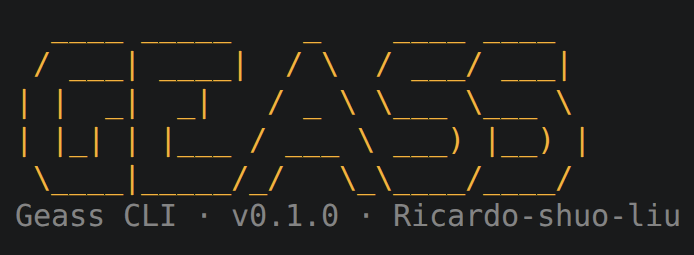

# Geass

<p align="center">
  
</p>

> [English](README.md) · 中文
> 详细文档：[中文使用手册](docs/zh/index.md) · [English Guide](docs/en/index.md) · [设计文档](docs/DESIGN.md)

> **吾以 Geass 之名命令你 —— 去完成我的指令。**

名字与思想来自《Code Geass 反叛的鲁鲁修》：手机下达命令，电脑无条件执行。
Geass 把电脑变成"被施加 Geass"的执行端，手机是遥控器：在 PWA 里实时看屏幕，
用文字、语音或手动直控完成操作。命令入口、Agent 循环与动作执行的编排层代号
**Paisley-Park**。

> **状态**：功能 MVP。当前存在明确的平台与精度限制，不回避问题；使用前请阅读
> [已知问题与功能边界](docs/zh/known-issues.md)。

## 功能特性

- 实时屏幕推流与异地访问（Tailscale / Cloudflare 临时隧道）
- 扫码配对：`geass serve --qr` 打印一次性二维码，手机扫码免输地址与 Token
- 文字命令 + 语音命令（Web Speech API，whisper-1 兜底）
- 视觉 Agent："截图 → 模型 → 执行 → 验证"循环，支持 OCR 文本模式兜底
- 自判难度的任务系统：`plan` 规划、视觉/窗口/屏幕差异多通道验证与失败换方法
- 语义定位：`find_text` / `find_element` / `window_info`
- 手动直控：PWA 触屏 + 网页渲染的虚拟鼠标触摸板和虚拟键盘，不经模型
- 信任层：幽灵操作预览（屏幕标注 + 步骤进度 + 分级审核/一键放行）与隐私遮罩（推流/模型同步打码）
- 定时任务：对话中识别时间意图自动创建，长期任务经用户确认后持久化
- RAG 检索增强：锁定本地文件/文件夹为数据源，向量或本地词法检索并注入任务上下文
- MCP 工具接口：UI/命令行导入 stdio 或 Streamable HTTP 工具，导入自动测试、可逐服务器/工具启停与永久删除
- POT 反思：从交流痕迹提炼通用 COT 与角色 ROT 模板，自动/手动注入
- CIL 终端助手：独立于手机 GUI，light/deliberate 双模式复用全部资产
- 资产导出：`geass export` 把 SKILL、COT、ROT 按名称或全量备份到指定目录
- 统一命令行：`geass serve/cli/export/rag/mcp/config/check/pot/reset/commands`
- 手机端资源管理：可视化查看/管理记忆、MCP、RAG、技能、POT 与定时任务
- 后台任务：对话/面板一键后台执行，与前台并行，键鼠动作全局串行
- 上下文压缩：长任务自动摘要压缩早期消息，原文留档不丢失
- 可见终端：一键执行、流式输入、输出监控
- 持久记忆与空闲进化：高频使用模式自动沉淀为 SKILL
- SKILL 系统：仓库 `skills/` 作种子，运行时加载自 `~/.geass/.skill/`
- 安全边界、Token 认证、随时停止

## 快速开始

### 1. 安装

```bash
./scripts/install.sh            # 创建/更新 conda 环境 geass
./scripts/install.sh --all      # 连 Linux 系统依赖与前端依赖一起装
```

手动方式：

```bash
conda activate geass
pip install -r requirements.txt -i https://pypi.tuna.tsinghua.edu.cn/simple
```

### 2. 配置模型

```bash
# 顺序：API_KEY BASE_URL MODEL
python -m geass.config set sk-xxx https://api.deepseek.com deepseek-v4-flash
```

非视觉模型建议再配置 OCR Token（可选）：

```bash
python -m geass.config set --ocr-token YOUR_TOKEN
```

### 3. 启动

```bash
./scripts/run.sh            # 普通启动
./scripts/run.sh --qr       # 启动并打印扫码配对二维码
```

启动后控制台打印手机访问地址和每次启动随机生成的 Token；带 `--qr` 时会额外
打印二维码（5 分钟内有效、仅可使用一次），手机扫码即可自动连接，无需手输
地址与 Token。

### 4. 手机连接

手机与电脑连同一 Wi-Fi，浏览器打开 `http://<电脑IP>:8765`，输入 Token 即可。
不在同一网络时另开终端执行：

```bash
./scripts/remote.sh
```

## 文档

- [中文详细文档](docs/zh/index.md)：安装、OCR/配置、手动直控、SKILL、记忆与进化、接口、安全、限制
- [English documentation](docs/en/index.md)
- [设计文档与路线图](docs/DESIGN.md)
- [SKILL 编写说明](skills/README.md)
- [已知问题与功能边界](docs/zh/known-issues.md)：按功能域整理的当前限制与能力边界
